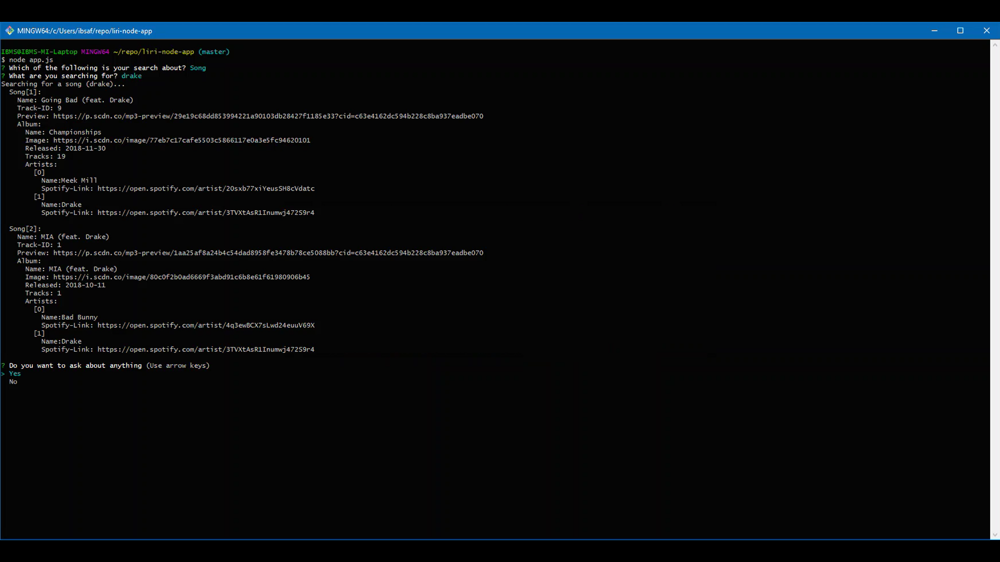

### liri-node-app
In this assignment, you will make LIRI. LIRI is like iPhone's SIRI. However, while SIRI is a Speech Interpretation and Recognition Interface, LIRI is a Language Interpretation and Recognition Interface. LIRI will be a command line node app that takes in parameters and gives you back data.

### Usage of the Script
This nodeJS script searches for a "Song", "Band", or "Movie" by choosing one of three options that prompted in the command line and shows all related results. Follow these tips for an appropriate usage:  
  1. Before running make sure all the `dependencies` are installed, which are `moment`, `axios`, `Node-Spotify-API`, and `inquirer`.
  2. Find a valid `apikey` for all of `OMDB API`, `Bands In Town API`, and `Node-Spotify-API` where they're an essential portion of the process.  
  3. After having all things set, run the `app.js` file by writing `node app.js` in the terminal's command line.
  4. Then the program will ask you to choose one type of your search, "Song", "Movie", or "Band".
  5. After you choosed your search type, the program will prompt you to type the `thing` that you're looking for.
  6. Then the program will present all information you're looking for in lines.
  7. Eventually, the program will ask if you want to make another search.
  
See the Figure below to see an excample of using the program.

